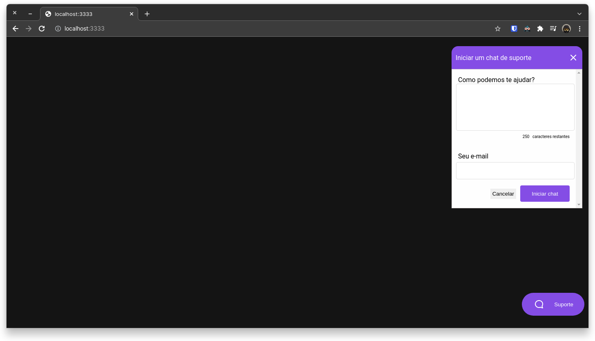

<h1 align="center">GitHub Search</h1>

## Description

An support chat app using Node, Express and websocket. 

## Screenshot

<p align="center">
  
</p>

## Technologies

1. Node
2. Express
3. Websocket

### Cool Dependencies

1. Typeorm
2. Sqlite

## Running project

<p align="justify">I used yarn for the entire project, but you can use npm, just search how to use it.</p>

```bash
# Clone the git repository
$ git clone https://github.com/datsfilipe/support-chat.git

# Enter the folder created by git clone
$ cd support-chat

# Install dependencies with yarn
$ yarn

# Run app in development mode
$ yarn dev

# Server will be listening on port 3333
```

### Node.js Project